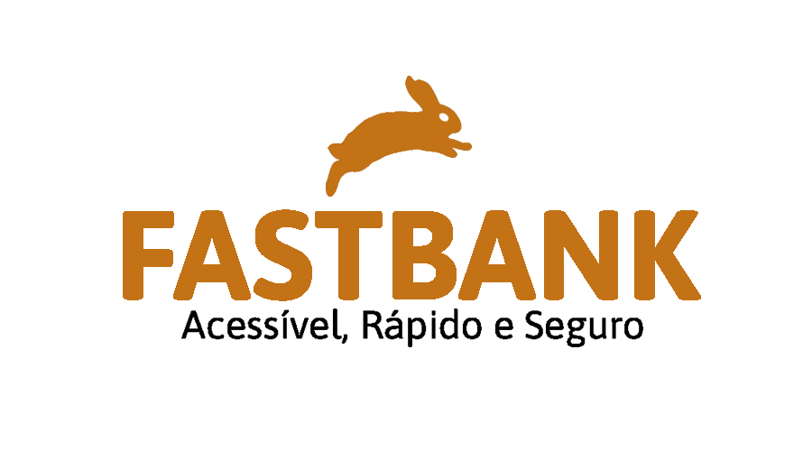

<p align="center"> 
  
</p>

<h2 align="center">
 :bank:  FastBank  :bank:
</h2>


<p align="center"> 
   
   
  
   
</p>

## :computer: Projeto 

FastBank é um projeto criado para o Trabalho de Conclusão de Curso da Pós Graduação da PUC Minas: Engenharia de Software. O intuito é aprimorar o conhecimento colocando-o em prática. Além disso, melhorar principalmente as habilidades de desenvolvimento, design e análise de sistema. 

Consiste em um projeto simples de um Banco Digital, com funcionalidades básicas como cadastro, login, acompanhamento das contas corrente e poupança e transferência. Há também uma área administrativa para o controle e avaliação de usuários.


## :rocket: Criado com

Este projeto foi desenvolvido com as seguintes tecnologias:

<details>
  <summary>Backend</summary>

-   [Node.js](https://nodejs.org/)
-   [Express](https://expressjs.com/)
-   [Javascript](https://www.w3schools.com/js/)
-   [VS Code](https://code.visualstudio.com/)

</details>

<details>
  <summary>Frontend</summary>

-   [Bootstrap](https://getbootstrap.com/)
-   [Javascript](https://www.w3schools.com/js/)
-   [CSS](https://www.w3schools.com/css/)
-   [JQuery](https://jquery.com/)
-   [VS Code](https://code.visualstudio.com/)

</details>

## :information_source: Como executar

Para executar a aplicação você precisará de:
* [Git](https://git-scm.com)
* [Node](https://nodejs.org/)
* [MySql](https://www.mysql.com/) 


### Backend
Agora clone o repositório e baixe as dependências.
```bash
# to clone the repository
$ git clone https://github.com/LuanCarlo/banco_digital.git

```
## :mailbox_with_mail: Contato

<a href="https://www.linkedin.com/in/luan-carlo-santos-de-paulo-ba467ba4/" target="_blank" >
  
</a>&nbsp;&nbsp;&nbsp;
<a href="mailto:luancarlo.paulo@gmail.com" target="_blank" >
  
</a> 

## :page_facing_up: Licença

Copyright (c) 2020 Luan Carlo Santos de Paulo

Todos os direitos reservados.
